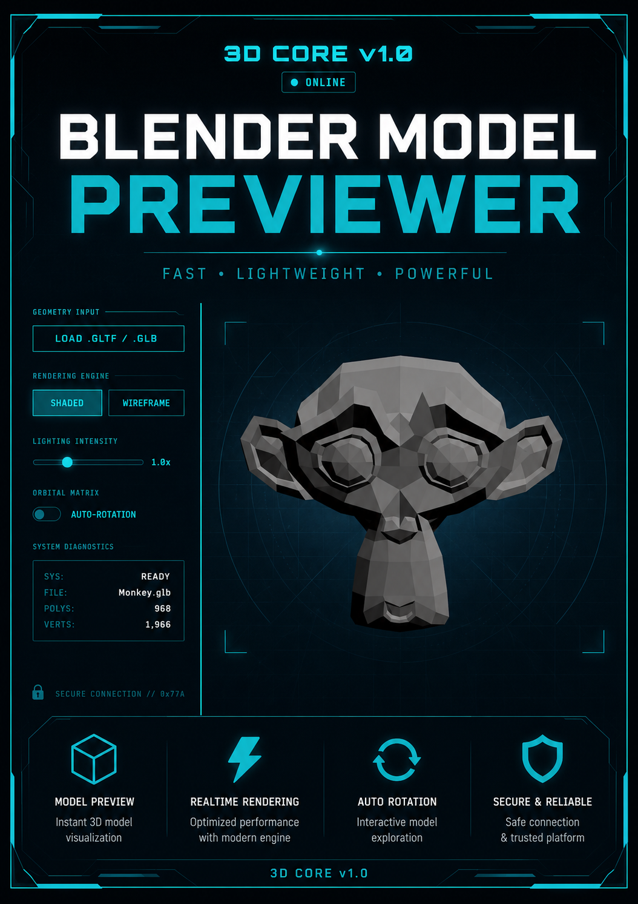

<div align="center">
  <h1>Blender Model Previewer</h1>
</div>

## Overview 

The Blender Model Previewer is a high-performance, lightweight desktop application built on the Electron framework designed for rapid, localized 3D asset inspection. By leveraging a Three.js-powered rendering engine bundled with Vite, the app combines native desktop speed with fluid, hardware-accelerated WebGL graphics. The project features a dynamic GLTF asset loader with proactive memory cleanup to prevent resource leaks, an adaptive camera and measurement sprite system that scales dynamically in real time, and a striking neon retro blue interface tailored for seamless 3D model visualization and diagnostic tracking.

---



## Repository Structure & Roles

```text
├── assets/                  # Branding assets, UI graphics, and application poster
├── index.html               # Frontend application viewport shell
├── index.js                 # Three.js core engine: scene initialization, lights, and render loops
├── main.js                  # Electron main process (native lifecycle & window management)
├── preload.js               # Electron context bridge (secure IPC communication)
├── style.css                # Retro Neon Blue theme styling and structural layout
├── vite.config.js           # Development server configuration and production bundling
└── package.json             # Build scripts, project metadata, and dependency tree
```
