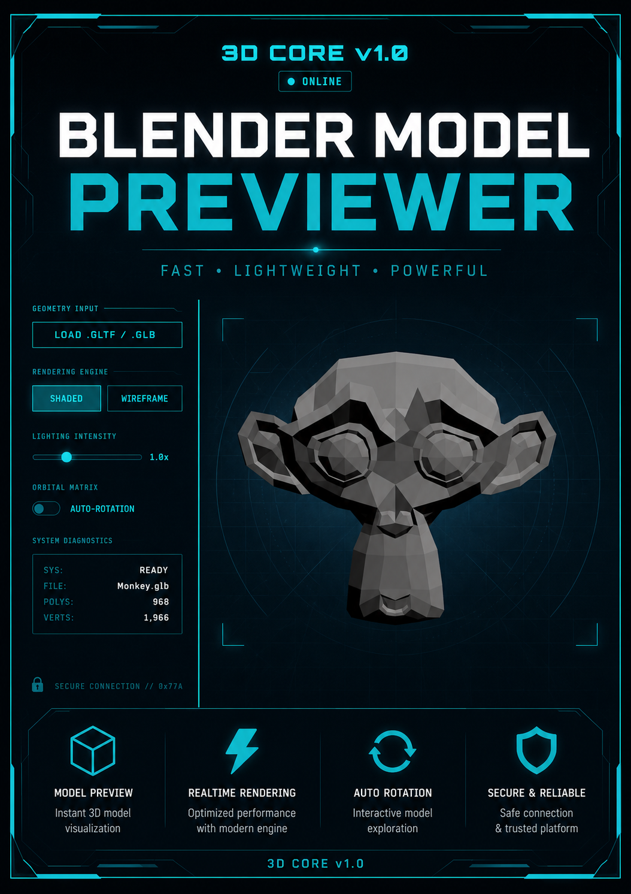

<div align="center">
  <h1>Blender Model Previewer</h1>
  <p>A high-performance, lightweight desktop application for rapid 3D asset inspection.</p>
</div>



## Overview

Blender Model Previewer is a desktop application built on the Electron framework, designed for fast and localized 3D asset inspection. It uses a Three.js-powered render engine to provide seamless 3D model viewing directly on your system, with no cloud dependency or external upload required.

## Repository Structure

```
.
├── assets/              # Branding assets, UI graphics, and application poster
├── index.html           # Frontend application viewport shell
├── index.js             # Three.js core engine, scene initialization, lights, and render loops
├── main.js              # Electron main process, native lifecycle and window management
├── preload.js           # Electron context bridge and secure IPC communication
├── style.css            # Retro Neon Blue theme styling and structural layout
├── vite.config.js       # Development server configuration and production bundling
└── package.json         # Build scripts, project metadata, and dependency tree
```

## Requirements

| Requirement | Details |
|---|---|
| Node.js | v16 or higher |
| npm or yarn | Comes bundled with Node.js |
| Git | Optional, for cloning the repository |
| OS | Windows 10+, macOS 10.13+, or Ubuntu 18.04+ |
| RAM | 2GB minimum, 4GB recommended |
| Storage | 500MB for application and dependencies |
| GPU | Any GPU with WebGL support |

## Installation

### Clone the Repository

```bash
git clone https://github.com/Darrenvandervelde/Blender-Model-Previewer.git
cd Blender-Model-Previewer
```

Alternatively, download the repository as a ZIP file and extract it to your preferred location.

### Install Dependencies

```bash
npm install
```

This installs Electron, Three.js, Vite, and electron-builder.

### Run in Development Mode

Start the Vite development server:

```bash
npm run dev
```

Then in a separate terminal, launch the Electron application:

```bash
npm start
```

### Build for Production

Build the web assets:

```bash
npm run build
```

Package the desktop application (Windows NSIS installer):

```bash
npm run electron-build
```

The packaged installer will be output to the `release/` directory.

## Available Scripts

| Command | Description |
|---|---|
| `npm run dev` | Start Vite development server with hot reload |
| `npm start` | Launch the Electron application |
| `npm run build` | Build optimized production assets |
| `npm run preview` | Preview the production build locally |
| `npm run electron-build` | Package the application into an installer |

## Supported File Formats

Blender Model Previewer supports the following 3D model formats:

- GLTF
- GLB
- OBJ

Ensure your model files are in one of these formats before loading them into the previewer.

## Troubleshooting

**npm install fails**
Ensure Node.js v16 or higher is installed. Verify by running `node --version`.

**Electron fails to start**
Clear the modules folder and reinstall:

```bash
rm -rf node_modules package-lock.json
npm install
```

**Three.js models do not render**
Confirm your model is in a supported format (GLTF, GLB, OBJ) and placed in the correct directory.

**Build fails on Windows**
Install the required build tools via Visual Studio, or run:

```bash
npm install --global windows-build-tools
```

## Contributing

Issues and pull requests are welcome. Please open an issue first to describe the change or feature before submitting a pull request.

## License

This project is licensed under the MIT License. See the [LICENSE](LICENSE) file for details.
